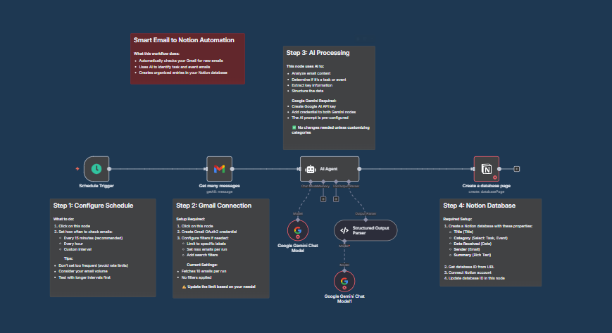

# 📧 Smart Email to Notion Automation

An intelligent N8N workflow that automatically monitors your Gmail, analyzes emails using AI, and creates organized entries in your Notion database. Say goodbye to manual email sorting and task management!

## 🚀 Features

- **📬 Gmail Monitoring** - Automatically checks for new emails on a scheduled basis
- **🤖 AI-Powered Analysis** - Uses Google Gemini to intelligently identify task and event emails while filtering out irrelevant messages
- **📊 Smart Data Extraction** - Extracts key information (title, summary, sender, date, category) from relevant emails
- **📝 Notion Integration** - Automatically creates organized entries in your Notion database for seamless task and event management
- **⚡ Real-time Processing** - Processes emails as they arrive with configurable intervals
- **🎯 Intelligent Filtering** - Filters out spam, promotional emails, and irrelevant content

## 🛠️ Requirements

Before setting up this workflow, ensure you have:

- [N8N](https://n8n.io/) installed and running
- Gmail account with API access
- [Google Gemini API](https://ai.google.dev/) key
- [Notion](https://notion.so/) workspace with database creation permissions

## 📋 Notion Database Setup

Create a Notion database with the following properties:

| Property Name | Type | Description |
|---------------|------|-------------|
| **Title** | Title | Email subject or extracted task title |
| **Category** | Select | Type of email (Task, Event, Information, etc.) |
| **Date Received** | Date | When the email was received |
| **Sender** | Email | Email address of the sender |
| **Summary** | Text | AI-generated summary of the email content |

## 🔧 Installation & Setup

### Step 1: Import the Workflow
1. Download the `Smart Email to Notion Automation.json` file
2. Open your N8N instance
3. Click on "Import from file" and select the downloaded JSON file

### Step 2: Configure Credentials
Set up the following credentials in N8N:

#### Gmail OAuth2
1. Go to [Google Cloud Console](https://console.cloud.google.com/)
2. Create a new project or select an existing one
3. Enable the Gmail API
4. Create OAuth2 credentials
5. Add the credentials to N8N

#### Google Gemini API
1. Get your API key from [Google AI Studio](https://ai.google.dev/)
2. Add the API key to N8N credentials

#### Notion API
1. Go to [Notion Developers](https://developers.notion.com/)
2. Create a new integration
3. Get your integration token
4. Share your database with the integration
5. Add the credentials to N8N

### Step 3: Configure the Workflow
1. Update the Notion database ID in the workflow nodes
2. Adjust the email checking schedule (recommended: every 15 minutes)
3. Customize the AI prompt for email analysis if needed
4. Set up any additional filters for email processing

### Step 4: Test and Activate
1. Run a manual test to ensure all connections work
2. Check that emails are being processed correctly
3. Verify that entries are created in your Notion database
4. Activate the workflow for automatic processing

## ⚙️ Configuration Options

- **Email Check Frequency**: Adjust how often the workflow checks for new emails
- **AI Analysis Prompt**: Customize the prompt sent to Google Gemini for better categorization
- **Notion Properties**: Modify which data points are extracted and stored
- **Email Filters**: Add additional filters to process only specific types of emails

## 🔍 How It Works

1. **Email Monitoring**: The workflow periodically checks your Gmail for new emails
2. **Content Analysis**: Google Gemini analyzes email content to determine relevance and category
3. **Data Extraction**: Key information is extracted from relevant emails
4. **Database Creation**: Structured entries are automatically created in your Notion database
5. **Continuous Processing**: The cycle repeats based on your configured schedule

## 🎯 Use Cases

Perfect for:
- **Task Management**: Automatically capture action items from emails
- **Event Tracking**: Extract meeting invitations and important dates
- **Email Organization**: Categorize and summarize important communications
- **Productivity Enhancement**: Reduce manual email processing time
- **Knowledge Management**: Build a searchable database of important email content

## 📝 Setup Time

- **Initial Setup**: 5-10 minutes
- **Testing**: 2-3 minutes
- **Total Time**: Under 15 minutes

## 🐛 Troubleshooting

Common issues and solutions are documented in the sticky notes within the N8N workflow. If you encounter problems:

1. Check all API credentials are correctly configured
2. Verify the Notion database permissions
3. Ensure the Gmail API is enabled in Google Cloud Console
4. Review the workflow execution logs in N8N

## 📄 License

This project is licensed under the MIT License - see the [LICENSE](LICENSE) file for details.

## 🤝 Contributing

Contributions are welcome! Feel free to submit issues, feature requests, or pull requests to improve this automation workflow.

---

**Made with ❤️ using N8N, Google Gemini AI, and Notion**
